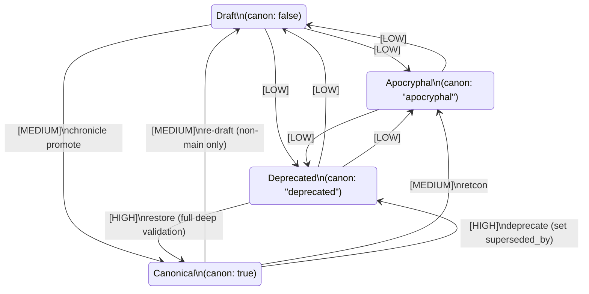

# D-11: Canon Workflow Specification

**Document ID:** D-11
**Version:** 0.1.0-draft
**Status:** Draft
**Author:** Ryan (with specification guidance from Claude)
**Created:** 2026-02-10
**Last Updated:** 2026-02-10
**Dependencies:** D-10 (§4.2, §4.6, §4.7, §4.8 — Lore File Schema), D-01 (§4.4 — Canon Management Workflow)
**Downstream Consumers:** D-12 (Validation Rule Catalog), D-13 (CLI Command Reference), D-14 (LLM Integration Specification), D-15 (Integration Design Document)
**Design Decisions:** See `D-11-design-decisions.md` for the seven locked design decisions (OQ-D11-1 through OQ-D11-7) that govern this specification.

---

## Table of Contents

- [1. Document Purpose and Scope](#1-document-purpose-and-scope)
- [2. Conventions and Terminology](#2-conventions-and-terminology)
- [3. Canon Status Model](#3-canon-status-model)
  - [3.1. The Four Canon States](#31-the-four-canon-states)
  - [3.2. Canon Status as Content Lifecycle](#32-canon-status-as-content-lifecycle)
- [4. State Machine: Valid Transitions](#4-state-machine-valid-transitions)
  - [4.1. State Machine Diagram](#41-state-machine-diagram)
  - [4.2. Ceremony Tiers Overview](#42-ceremony-tiers-overview)
  - [4.3. Low Ceremony Transitions](#43-low-ceremony-transitions)
  - [4.4. Medium Ceremony Transitions](#44-medium-ceremony-transitions)
  - [4.5. High Ceremony Transitions](#45-high-ceremony-transitions)
  - [4.6. Prohibited Direct Transitions](#46-prohibited-direct-transitions)
- [5. Workflows](#5-workflows)
  - [5.1. Promotion Workflow (Draft → Canonical)](#51-promotion-workflow-draft--canonical)
  - [5.2. Deprecation Workflow (Canonical → Deprecated)](#52-deprecation-workflow-canonical--deprecated)
  - [5.3. Apocryphal Workflow](#53-apocryphal-workflow)
  - [5.4. Restoration Workflow (Deprecated → Canonical)](#54-restoration-workflow-deprecated--canonical)
  - [5.5. Re-Drafting Workflow (Canonical → Draft)](#55-re-drafting-workflow-canonical--draft)
  - [5.6. Retcon Workflow (Canonical → Apocryphal)](#56-retcon-workflow-canonical--apocryphal)
- [6. Superseding Mechanics (Behavioral)](#6-superseding-mechanics-behavioral)
  - [6.1. The Superseding Lifecycle](#61-the-superseding-lifecycle)
  - [6.2. Ripple Effect Management](#62-ripple-effect-management)
  - [6.3. Superseding Validation Summary](#63-superseding-validation-summary)
- [7. Branch Conventions](#7-branch-conventions)
  - [7.1. Default Branch Mapping](#71-default-branch-mapping)
  - [7.2. Branch-Canon Consistency Checks](#72-branch-canon-consistency-checks)
  - [7.3. Configuring Branch Conventions](#73-configuring-branch-conventions)
- [8. Merge Semantics](#8-merge-semantics)
  - [8.1. Standard Merge Behavior](#81-standard-merge-behavior)
  - [8.2. Canon Field Conflict Resolution](#82-canon-field-conflict-resolution)
  - [8.3. Conflict Scenarios and Resolution Guidance](#83-conflict-scenarios-and-resolution-guidance)
  - [8.4. Post-Merge Validation](#84-post-merge-validation)
- [9. Validation Rules (Canon-Specific)](#9-validation-rules-canon-specific)
  - [9.1. Apocryphal Validation Relaxation](#91-apocryphal-validation-relaxation)
  - [9.2. Canon Consistency Checks](#92-canon-consistency-checks)
  - [9.3. Superseding Validation](#93-superseding-validation)
  - [9.4. Integration with D-12](#94-integration-with-d-12)
- [10. Changelog Integration](#10-changelog-integration)
  - [10.1. Automatic Changelog Entries](#101-automatic-changelog-entries)
  - [10.2. Manual Changelog Entries](#102-manual-changelog-entries)
  - [10.3. Changelog Storage and Format](#103-changelog-storage-and-format)
  - [10.4. What Is NOT Logged](#104-what-is-not-logged)
- [11. Edge Cases and Resolution Procedures](#11-edge-cases-and-resolution-procedures)
  - [11.1. Child Document Canon Conflicts](#111-child-document-canon-conflicts)
  - [11.2. Circular Superseding Chains](#112-circular-superseding-chains)
  - [11.3. Orphaned Deprecated Files](#113-orphaned-deprecated-files)
  - [11.4. Cherry-Pick Canon Implications](#114-cherry-pick-canon-implications)
  - [11.5. Promoting Apocryphal Content](#115-promoting-apocryphal-content)
  - [11.6. Bulk Operations](#116-bulk-operations)
  - [11.7. Rollback After Promotion](#117-rollback-after-promotion)
- [12. Multi-File Entity Canon Behavior](#12-multi-file-entity-canon-behavior)
  - [12.1. Canon Status Inheritance](#121-canon-status-inheritance)
  - [12.2. Promoting Multi-File Entities](#122-promoting-multi-file-entities)
  - [12.3. Deprecating Multi-File Entities](#123-deprecating-multi-file-entities)
- [13. Dependencies and Cross-References](#13-dependencies-and-cross-references)
- [14. Document Revision History](#14-document-revision-history)

---

## 1. Document Purpose and Scope

This document defines the **behavioral lifecycle of canonical status** in Chronicle lore files. It specifies which transitions between canon states are permitted, under what conditions, with what degree of ceremony (validation complexity), and how each transition affects the repository, the changelog, and the search index.

**What D-11 defines:**

- The four canon states (`true`, `false`, `"apocryphal"`, `"deprecated"`) and their semantic meaning in the context of an editorial workflow
- All twelve valid transitions between states, organized into three ceremony tiers (low, medium, high), plus one prohibited direct transition
- Step-by-step procedures for the six canonical workflows: promotion, deprecation, apocryphal creation, restoration, re-drafting, and retconning
- The behavior of the superseding system: how deprecated content links to replacement content, how many-to-one consolidation works, and how chains are resolved
- Validation rules specific to canon status transitions (deterministic checks only; LLM-powered validation is deferred to D-14)
- Git integration patterns: branch naming conventions, merge conflict resolution strategies, and when to use which pattern
- Changelog generation: which transitions trigger automatic entries and how manual changelog entries are created
- Edge case handling for complex scenarios (circular chains, orphaned files, bulk operations, rollback)

**What D-11 does NOT define:**

- The data schema for the `canon` field itself (defined in D-10 §4.2)
- The data schema for `superseded_by` and `supersedes` fields (defined in D-10 §4.6 and §4.8)
- The complete catalog of validation rules and their error/warning/info messages (defined in D-12)
- The CLI commands, flags, and parameters for promoting, validating, and logging (defined in D-13)
- LLM-powered semantic validation, contradiction detection, and narrative tension analysis (defined in D-14)

**Relationship to upstream documents:**

- **D-10 (Lore File Schema Specification):** D-11 builds on the data model. The `canon` field is the input; D-11 specifies the rules that govern how that field changes.
- **D-01 (Design Proposal, §4.4):** D-11 formalizes the canon management workflow outlined in the design proposal.
- **D-04 (Master Strategy, §6.3):** D-11 fulfills the requirements specified in the Master Strategy for the Canon Workflow Specification.

---

## 2. Conventions and Terminology

### Core Terms

**Canon status** — The value of the `canon` field in a lore file's frontmatter. One of four discrete states: `true` (canonical), `false` (draft), `"apocryphal"`, or `"deprecated"`.

**Canonical (state: `true`)** — Content that is part of the official, established continuity of the world. Canonical content has been validated and approved for inclusion in canon. By convention, canonical content lives on the `main` branch.

**Draft (state: `false`)** — Content that is work-in-progress and has not yet been approved for canon. May contain placeholders, incomplete sections, or speculative elements. By convention, draft content lives on feature branches.

**Apocryphal (state: `"apocryphal"`)** — Content that is explicitly non-canonical. It represents "what if" explorations, alternate timelines, cut content, or creative exercises the author preserves but never intends to merge into canon. Apocryphal content is allowed to contradict canon.

**Deprecated (state: `"deprecated"`)** — Content that was formerly canonical but has been superseded by newer content. The file remains in the repository for historical reference. The `superseded_by` field points to the replacement document.

**Canon transition** — A change in a file's canon status. For example, changing `canon: false` to `canon: true` is a "promotion transition."

**Ceremony** — The degree of validation and approval required before a transition is allowed. Three tiers: low (no special validation), medium (deterministic validation required), high (full validation including LLM checks required).

**Promotion** — The transition from draft (`false`) to canonical (`true`). Executed via the `chronicle promote` command.

**Deprecation** — The transition from canonical (`true`) to deprecated (`"deprecated"`). Requires setting the `superseded_by` field.

**Retcon** — Short for "retroactive continuity." In Chronicle, a retcon is the transition from canonical (`true`) to apocryphal (`"apocryphal"`), explicitly removing content from canon but preserving it as alternate-history material.

**Restoration** — The transition from deprecated (`"deprecated"`) back to canonical (`true`). Requires full validation and confirmation because the content may have drifted out of consistency while deprecated.

**Re-drafting** — The transition from canonical (`true`) to draft (`false`). Used when canonical content needs significant rework. Must happen on a non-`main` branch.

**Superseding** — The relationship between a deprecated entry and its replacement. The deprecated file declares `superseded_by: "path/to/replacement.md"`. The replacement file's `supersedes` field is inferred to list all files it supersedes. Supports many-to-one consolidation: multiple deprecated files can point to one replacement.

**Superseding chain** — A sequence of superseding relationships: A is superseded by B, B is superseded by C. Chronicle resolves chains to identify the "final" replacement (C) for display in search results.

### Notation Conventions

- **File paths** are always relative to the repository root and use forward slashes: `factions/iron-covenant.md`, `characters/elena-voss/biography.md`.
- **Canon state values** are written in their YAML representation: `canon: true`, `canon: false`, `canon: "apocryphal"`, `canon: "deprecated"`.
- **Transitions** are written as state arrows: `false → true` means "from draft to canonical."
- **Ceremony tier labels** appear in brackets: **[LOW]** for no special validation, **[MEDIUM]** for deterministic validation, **[HIGH]** for full validation.
- **Commands** are written in monospace: `chronicle promote`, `chronicle validate`.
- **Flags** are written with double hyphens: `--dry-run`, `--include-deprecated`.

---

## 3. Canon Status Model

### 3.1. The Four Canon States

Chronicle recognizes four discrete canon statuses, each with distinct semantics and behavioral implications:

| State | YAML Value | Meaning | Branch Convention | Search Inclusion |
|-------|-----------|---------|-------------------|------------------|
| **Canonical** | `canon: true` | Part of the official, established world. Validated and approved. | `main` | Default; always searchable |
| **Draft** | `canon: false` | Work-in-progress; not yet approved for canon. | Feature branches | Excluded by default; `--include-draft` to include |
| **Apocryphal** | `canon: "apocryphal"` | Explicitly non-canonical exploration, alternate timeline, or cut content. | `apocrypha/*` | Excluded by default; `--include-apocrypha` to include |
| **Deprecated** | `canon: "deprecated"` | Formerly canonical; superseded by newer content. Preserved for history. | `main` | Excluded by default; `--include-deprecated` to include |

**Semantic Implications:**

- **Canonical content** is the "source of truth" for the world. It must pass all validation checks, including cross-reference integrity, timeline consistency, axiom enforcement, and (optionally) LLM-powered contradiction detection. Canonical content should be treated as immutable on the `main` branch except via explicit deprecation or retconning workflows.

- **Draft content** is explicitly *not* the source of truth. It may reference undefined entities, violate timeline constraints, or contain incomplete sections. The purpose of drafting is to allow worldbuilders to explore ideas without committing to them. Draft content is intended to be either promoted to canonical or abandoned.

- **Apocryphal content** is an "alternate world." It is allowed to contradict canonical content, violate timeline constraints, and break cross-reference integrity. The validation rules are deliberately relaxed for apocryphal content because the whole point is to explore "what if" scenarios. Apocryphal content should never be promoted directly to canon — it must first pass through draft status (see §4.6).

- **Deprecated content** is "archived canon." It was once the source of truth, but it has been superseded. Deprecated files remain in the repository to preserve editorial history (showing how the world evolved over time) and to maintain referential integrity. Deprecated content is not the source of truth and should not be edited; if it needs revision, it should be restored to canonical via the restoration workflow.

**Implementation Note:** The mixed typing of the `canon` field (boolean `true`/`false` or string `"apocryphal"`/`"deprecated"`) is ergonomic by design. In YAML, `true` and `false` are native types that read naturally in frontmatter. The string values extend the boolean space with states that have no natural boolean representation. The validator normalizes all four values to a `CanonStatus` enum internally. See D-10 §4.2 for the full field specification.

### 3.2. Canon Status as Content Lifecycle

The four canon states form a **content lifecycle** that tracks the *editorial status* of an entry, not its in-world narrative truth.

Consider a concrete example from Aethelgard — the Iron Covenant faction entry. A worldbuilder might trace this lifecycle:

1. **Draft phase:** Author creates `factions/iron-covenant.md` with `canon: false`. The entry contains a placeholder founding date, incomplete military structure, and a half-drafted charter.

2. **Apocryphal exploration:** Author creates a branch and writes `factions/iron-covenant-alternate.md` with `canon: "apocryphal"`, exploring what the faction would look like if it were founded by different historical figures. This contradicts the canonical founding narrative but serves as creative exploration.

3. **Promotion to canonical:** Author revises the main `iron-covenant.md` entry on a feature branch, runs `chronicle promote` to set `canon: true`, and merges to `main`. The entry is now canonical.

4. **Retconning:** After publishing, the author realizes the founding date conflicts with the Age of Echoes timeline. Rather than simply revising, the author decides the conflict is irreconcilable and retcons the entire faction. They change `canon: true` to `canon: "apocryphal"`, preserving the original vision as alternate-history material. A new Iron Covenant entry (`iron-covenant-revised.md`) becomes canonical with the corrected date.

5. **Deprecation and consolidation:** Later, the author decides to split the Iron Covenant into two subsidiary factions. They deprecate the revised entry with `canon: "deprecated"` and `superseded_by` pointing to the two new entries.

The lifecycle demonstrates that **canon status is an editorial state machine, not a statement of in-world truth.** An entry can be drafted, explored, approved, retconned, and superseded over time. The workflow ensures that only intentional, validated changes reach canonical status.

---

## 4. State Machine: Valid Transitions

### 4.1. State Machine Diagram

The following diagram shows all twelve valid transitions between the four canon states, annotated with ceremony tier labels. One transition (`apocryphal → canonical`) is **prohibited** and requires a two-step path through draft.



**Text-Based Transition Table:**

| From State | To State | Ceremony | Trigger | Notes |
|---|---|---|---|---|
| draft | canonical | **MEDIUM** | `chronicle promote` | Deterministic validation required |
| draft | apocryphal | LOW | Edit `canon` field | Reclassify as what-if exploration |
| draft | deprecated | LOW | Edit `canon` field | Abandon in favor of different approach |
| canonical | draft | **MEDIUM** | Edit `canon` field | Non-`main` branch only; for significant rework |
| canonical | deprecated | **HIGH** | Edit `canon` + set `superseded_by` | Full validation + LLM deep checks recommended |
| canonical | apocryphal | **MEDIUM** | Edit `canon` field | Retcon; explicit confirmation recommended |
| apocryphal | draft | LOW | Edit `canon` field | Convert exploration to proper draft |
| apocryphal | deprecated | LOW | Edit `canon` field | Supersede old exploration |
| apocryphal | canonical | **PROHIBITED** | — | Must go through draft first |
| deprecated | draft | LOW | Edit `canon` field | Revive as new draft |
| deprecated | apocryphal | LOW | Edit `canon` field | Reclassify as alternate-history |
| deprecated | canonical | **HIGH** | Full validation + confirmation | Content may have drifted; full re-validation required |

### 4.2. Ceremony Tiers Overview

The three ceremony tiers reflect the **risk level** of each transition. Higher-risk transitions require more rigorous validation and author confirmation.

**[LOW] — No Special Validation**

The author simply edits the `canon` field in the YAML frontmatter. No command execution required; no special validation checks. The field change is treated like any other frontmatter edit.

*Rationale:* These transitions represent editorial bookkeeping between non-canonical states (or from canonical to non-canonical in low-risk ways). They don't introduce content into canon, so they pose minimal risk. They don't trigger changelog entries (per OQ-D11-6) because they don't affect the official continuity.

**[MEDIUM] — Deterministic Validation Required**

The transition requires `chronicle validate` (deterministic checks only) to pass. Some transitions have additional conditions (e.g., branch constraints).

*Rationale:* These transitions either introduce content into canonical status (`false → true`) or remove it with narrative implications (`true → false`, `true → "apocryphal"`). They require structural soundness before the transition is allowed.

**[HIGH] — Full Validation Required (Deterministic + Deep)**

The transition requires `chronicle validate --deep` (deterministic checks AND LLM-powered semantic validation) to pass. Full author confirmation is required.

*Rationale:* These transitions carry the highest risk of introducing inconsistencies. Deprecating canonical content requires assurance the replacement exists and is narratively consistent. Restoring deprecated content requires assurance it hasn't drifted.

### 4.3. Low Ceremony Transitions

These six transitions require only a field edit. No validation, no command execution, no confirmation.

| Transition | Use Case |
|---|---|
| `false → "apocryphal"` | Reclassify a draft as a what-if exploration. Commonly used when an author wants to preserve exploratory ideas without committing them as drafts. |
| `"apocryphal" → false` | Convert an apocryphal exploration into a proper draft for promotion. Used when an author decides to rehabilitate an exploration as a serious candidate for canonical status. |
| `false → "deprecated"` | Abandon a draft in favor of a different approach. Marks "paths not taken" while preserving them in Git history. |
| `"apocryphal" → "deprecated"` | Supersede an old what-if with a newer one. The `superseded_by` field SHOULD be set but is not required. |
| `"deprecated" → false` | Revive deprecated content as a new draft. Used when an author reconsiders a deprecated entry for potential re-promotion. |
| `"deprecated" → "apocryphal"` | Reclassify deprecated content as alternate-history material. The author explicitly decides the old version is interesting as a what-if rather than as historical editorial fact. |

**No changelog entries are generated for low-ceremony transitions.**

**Implementation Note (Phase 2):** Low-ceremony transitions are the simplest to implement. The validator does not need to perform special checks; the field change is allowed on any branch.

### 4.4. Medium Ceremony Transitions

These three transitions require deterministic validation to pass. Additional branch or confirmation constraints apply.

#### `false → true` (Promotion)

| Aspect | Detail |
|--------|--------|
| **Use Case** | Standard promotion of a draft to canonical. Author has refined the draft, is confident in its consistency, and wants to commit it to canon. |
| **Command** | `chronicle promote` (see D-13 for full syntax) |
| **Validation** | Deterministic validation must pass: schema checks, cross-reference integrity, timeline consistency, axiom enforcement (hard), uniqueness constraints, alias collision detection, canon consistency. |
| **Confirmation** | Required. `chronicle promote` displays the promotion plan and prompts the author. The `--dry-run` flag allows preview without side effects. |
| **Changelog** | Automatic. Type: "New Entry." |

#### `true → false` (Re-Drafting)

| Aspect | Detail |
|--------|--------|
| **Use Case** | Author needs to make significant revisions to canonical content and returns it to draft status during the revision process. |
| **Command** | Edit `canon: true` to `canon: false` in the file's YAML. |
| **Validation** | Deterministic validation must pass on the feature branch. |
| **Additional Conditions** | **MUST** be done on a non-`main` branch. If done on `main`, the validator emits a warning: "canonical content reverted to draft on `main` — this should only happen on feature branches." |
| **Changelog** | Automatic. Type: "Returned to Draft." |

#### `true → "apocryphal"` (Retconning)

| Aspect | Detail |
|--------|--------|
| **Use Case** | Author decides that content which was once canonical should be removed from the official continuity but preserved as alternate-history material. |
| **Command** | Edit `canon: true` to `canon: "apocryphal"` in the YAML. |
| **Validation** | Deterministic validation must pass. |
| **Confirmation** | Recommended. Significant editorial decision — the author should explicitly confirm the retcon. |
| **Changelog** | Automatic. Type: "Retconned." |

### 4.5. High Ceremony Transitions

These two transitions require full validation (deterministic + LLM-powered deep checks) and explicit author confirmation.

#### `true → "deprecated"` (Deprecation)

| Aspect | Detail |
|--------|--------|
| **Use Case** | Author is superseding canonical content with newer/better content. The old entry is no longer the source of truth. |
| **Command** | Edit `canon` to `"deprecated"` and set `superseded_by` to the replacement file path. |
| **Validation** | Full validation required. Deterministic checks MUST pass. LLM-powered validation (`--deep`) **recommended** to detect narrative contradictions with the replacement. |
| **Additional Conditions** | **MUST set `superseded_by`** to the path of the replacement file. Missing `superseded_by` emits an error. The target file must exist. |
| **Confirmation** | Required. Author explicitly confirms: "This entry is being superseded by [replacement]. Continue?" |
| **Changelog** | Automatic. Type: "Deprecated." |

#### `"deprecated" → true` (Restoration)

| Aspect | Detail |
|--------|--------|
| **Use Case** | Author is un-deprecating content that was previously superseded. High risk: the content may have drifted out of consistency while deprecated. |
| **Command** | Edit `canon` to `true`. Optionally clear or update `superseded_by`. |
| **Validation** | Full validation required. Deterministic checks MUST pass. LLM-powered validation (`--deep`) **required** to ensure consistency with current canon. |
| **Confirmation** | Required. Author explicitly confirms: "You are restoring [entry] to canonical. It was previously superseded by [replacement]. Continue?" |
| **Changelog** | Automatic. Type: "Restored." |

### 4.6. Prohibited Direct Transitions

#### `"apocryphal" → true` (NOT ALLOWED)

**Prohibited:** Direct promotion from apocryphal to canonical.

**Required Path:** `"apocryphal" → false → true`

**Rationale:** Apocryphal content is explicitly allowed to contradict canon. Promoting it directly to canonical would bypass the draft review stage, risking the introduction of contradictions that could destabilize the canon. By forcing the content through a draft stage, the author must explicitly address contradictions and prepare the content for canonical status.

**Implementation:** The validator emits an error if `chronicle promote` is invoked on an apocryphal file: "Apocryphal content cannot be directly promoted to canonical. First convert to draft (`canon: false`) for review."

**Workaround:** Author edits `canon: "apocryphal"` to `canon: false` (low ceremony), then runs `chronicle promote` (medium ceremony, full validation). The draft stage forces a review.

---

## 5. Workflows

This section provides step-by-step procedures for each of the six primary canon workflows. Each workflow includes: when to use it, the step-by-step procedure, what happens at each step, and common pitfalls.

### 5.1. Promotion Workflow (Draft → Canonical)

**When to use:** You've completed a draft lore entry (or set of entries) and are confident they're ready for the official canon. You want to move them from `canon: false` to `canon: true`, ensuring they pass validation before they hit `main`.

**Prerequisite:** The file(s) to be promoted are on a feature branch, with `canon: false`.

**Example scenario:** You've written `factions/iron-covenant.md` on a feature branch `feature/iron-covenant`. It's complete, cross-referenced to existing entries, and timeline-consistent. Now you want to promote it.

#### Step 1: Create Feature Branch

```bash
git checkout -b feature/iron-covenant
# Create or edit factions/iron-covenant.md with canon: false
git add factions/iron-covenant.md
git commit -m "Draft: Iron Covenant faction entry"
```

#### Step 2: Validate the Draft

```bash
chronicle validate
```

Output example:
```
Chronicle Validation Report
===========================
Files scanned: 1
Schema errors: 0
Cross-reference errors: 0
Timeline warnings: 0
Uniqueness warnings: 0
Canon consistency warnings: 0

✓ factions/iron-covenant.md (draft) — OK
```

If validation fails, fix the issues and commit again. Common failures include schema errors (missing required fields), broken cross-references (targets don't exist), timeline violations (dates outside era boundaries), and canon consistency warnings (canonical entry references draft content).

#### Step 3: Optional Deep Validation

```bash
chronicle validate --deep
```

This runs LLM-powered semantic validation to detect narrative contradictions that deterministic checks cannot catch. Example output:

```
Chronicle Deep Validation Report
=================================
Deterministic checks: ✓ PASS
LLM validation: ⚠ CAUTION

factions/iron-covenant.md:
  ⚠ The founding date (412 PG) may conflict with the Age of Echoes
    timeline, which places the Iron Covenant's precursor organization
    in 410 PG. Review: Is this intentional?
```

#### Step 4: Promote the File

```bash
chronicle promote factions/iron-covenant.md
```

This command:

1. Validates the file one more time (deterministic checks).
2. Displays the promotion plan and prompts for confirmation.
3. Changes `canon: false` to `canon: true` in the file.
4. Commits the change with a message like `"Promote: Iron Covenant faction entry"`.
5. Generates a changelog entry of type "New Entry."

Output example:
```
Chronicle Promote
=================
Files to promote: 1

  factions/iron-covenant.md: false → true

Proceed? (y/n): y

✓ factions/iron-covenant.md promoted.
  Changelog: "New Entry: Faction — The Iron Covenant"

Commit: a1b2c3d (Promote: Iron Covenant faction entry)
```

**`--dry-run` flag:** Preview the promotion without applying changes:

```bash
chronicle promote --dry-run factions/iron-covenant.md
```

**`--all` flag:** Promote all draft files on the current branch:

```bash
chronicle promote --all
```

**Optional changelog note:** During promotion, Chronicle may prompt: "Add an optional changelog note for this promotion? (y/n)". The note is recorded alongside the automatic "New Entry" changelog entry.

#### Step 5: Merge to `main`

```bash
git checkout main && git merge feature/iron-covenant
# Or push and create a pull request
```

When the feature branch is merged to `main`, the promoted entries are canonical.

### 5.2. Deprecation Workflow (Canonical → Deprecated)

**When to use:** You're superseding canonical content with newer/better content. The old entry should be marked as deprecated, linked to the replacement, and preserved for historical reference.

**Example scenario:** You've published `factions/iron-covenant.md` (canonical), but you've decided to split it into two factions: `factions/iron-covenant-main.md` and `factions/iron-covenant-shadow.md`. The original entry should be deprecated.

#### Step 1: Create the Replacement Entry/Entries

Before deprecating, ensure the replacement(s) exist. Promote them via the standard workflow (§5.1).

```bash
git checkout -b feature/iron-covenant-split
# Create factions/iron-covenant-main.md (canon: false)
# Create factions/iron-covenant-shadow.md (canon: false)
chronicle promote --all
git commit -m "Promote: Iron Covenant (main and shadow branches)"
```

#### Step 2: Deprecate the Old Entry

On the same branch:

```yaml
# Edit factions/iron-covenant.md:
---
type: faction
name: The Iron Covenant
canon: "deprecated"
superseded_by: "factions/iron-covenant-main.md"
---
```

**Note:** For one-to-many splits, `superseded_by` points to the primary replacement. If both replacements should be linked, the `supersedes` field on each replacement file captures the full picture (via automatic inference from `superseded_by`).

#### Step 3: Validate

```bash
chronicle validate --deep
```

Validation checks that the deprecated entry has a valid `superseded_by` reference, that the target exists, and that there are no circular chains. Deep validation checks for narrative consistency between the deprecated entry and its replacements.

#### Step 4: Commit and Merge

```bash
git add factions/iron-covenant.md
git commit -m "Deprecate: Iron Covenant (superseded by main and shadow branches)"
git checkout main && git merge feature/iron-covenant-split
```

**What happens after merge:**

- The original entry is marked `canon: "deprecated"`.
- Chronicle's search excludes it by default but may note: "Also found deprecated entry: The Iron Covenant (superseded by The Iron Covenant [main])."
- The changelog records: "Deprecated: Faction — The Iron Covenant."
- The replacement files' `supersedes` field is automatically inferred.

**Bidirectional inference:** Chronicle reads the deprecated file's `superseded_by` and computes the reverse relationship on the replacement files without modifying their YAML on disk. See D-10 §4.8 for full superseding mechanics.

### 5.3. Apocryphal Workflow

**When to use:** You want to explore "what if" scenarios, alternate timelines, or creative ideas that might contradict canon. Apocryphal content is deliberately allowed to break canon rules because exploration is the point.

**Apocryphal content is NOT intended to be promoted directly to canon.** If you want to rehabilitate an apocryphal idea, it must first be converted to a draft and then promoted normally (see §4.6 and §11.5).

**Example scenario:** You want to explore an alternate history of the Iron Covenant where it was founded by the Forsaken instead of the Knights Ardent. This contradicts canonical founding narrative, but that's fine — it's a what-if.

#### Step 1: Create an Apocryphal Entry

```bash
git checkout -b apocrypha/iron-covenant-alternate
```

```yaml
---
type: faction
name: The Iron Covenant (Alternate Timeline)
canon: "apocryphal"
summary: What if the Iron Covenant had been founded by the Forsaken?
---

# The Iron Covenant (Alternate Timeline)

In this alternate history, the Iron Covenant was founded by the Forsaken...
```

#### Step 2: Validation (Optional)

Apocryphal entries do not need to pass full validation. Schema validation still applies (the file must be valid YAML with required fields), but narrative rules are relaxed. See §9.1 for the full relaxation table.

```bash
chronicle validate  # Will show warnings only, not errors, for narrative rules
```

#### Step 3: Branch Convention

By convention, apocryphal content lives on branches named `apocrypha/*`. This is a soft convention enforced by informational notices. You can put apocryphal content on any branch — the convention helps organize but does not restrict.

#### Step 4: Commit

```bash
git add factions/iron-covenant-alternate.md
git commit -m "Explore: Iron Covenant (alternate timeline)"
```

#### Step 5: Convert to Draft (If Rehabilitating)

If you later decide this exploration is worth pursuing as canon:

```bash
# Change canon: "apocryphal" to canon: false (low ceremony)
# Then promote normally via chronicle promote (medium ceremony)
```

**Search behavior:** Apocryphal content excluded from search by default. Use `--include-apocrypha` to include.

### 5.4. Restoration Workflow (Deprecated → Canonical)

**When to use:** You previously deprecated an entry, but you've now decided to un-deprecate it. This might happen if the replacement turned out to be worse, or new information made the original entry valuable again.

**Warning:** High-ceremony operation. The deprecated entry may have drifted out of consistency while deprecated. Full validation (deterministic + LLM) is required.

#### Step 1: Create a Feature Branch

```bash
git checkout -b feature/restore-iron-covenant
```

#### Step 2: Edit the Entry

```yaml
# Change: canon: "deprecated"
# To:     canon: true
# Optionally remove superseded_by
```

#### Step 3: Run Full Validation

```bash
chronicle validate --deep
```

Full validation checks deterministic rules and LLM-powered contradiction detection. If the content drifted while deprecated (other canonical entries changed in ways that now conflict), the validator reports the issues.

#### Step 4: Confirm Restoration

```bash
chronicle promote factions/iron-covenant.md
```

The command confirms: "You are restoring [entry] to canonical. It was previously superseded by [replacement]. Continue?"

#### Step 5: Handle the Former Replacement

If the entry that superseded the now-restored entry is still canonical, consider deprecating it (or leaving both canonical if they cover different aspects).

#### Step 6: Merge to `main`

**Changelog entry:** "Restored: Faction — The Iron Covenant."

### 5.5. Re-Drafting Workflow (Canonical → Draft)

**When to use:** Canonical content needs significant rework. Rather than editing in place on `main`, you want to move it back to draft status on a feature branch, revise it, and re-promote.

**Key constraint:** Re-drafting MUST happen on a non-`main` branch. This prevents accidentally leaving canonical content in draft status on the main branch.

#### Step 1: Create a Feature Branch

```bash
git checkout -b feature/revise-iron-covenant
```

#### Step 2: Re-Draft

```yaml
# Change: canon: true
# To:     canon: false
```

#### Step 3: Make Revisions

Edit the Markdown body and frontmatter as needed.

#### Step 4: Validate and Re-Promote

```bash
chronicle validate
chronicle promote factions/iron-covenant.md
```

#### Step 5: Merge to `main`

**Changelog entry:** "Returned to Draft" when re-drafted, then "Revised" when re-promoted (if frontmatter fields changed).

**What if you accidentally re-draft on `main`?** `chronicle validate` on `main` catches this: "Draft content detected on `main` — run `chronicle promote` to restore canonical status."

### 5.6. Retcon Workflow (Canonical → Apocryphal)

**When to use:** You've published canonical content, but a significant conflict has arisen that can't be reconciled by editing. You want to retcon it: remove it from canon and preserve it as alternate-history material.

**Example scenario:** The Iron Covenant was promoted with a founding date of 415 PG. Later, the Age of Echoes timeline is finalized with a conflicting founding narrative. You retcon the original as "what happened in an alternate timeline" and write a new canonical entry with the correct narrative.

#### Step 1: Create Feature Branch and Write New Canonical Entry

```bash
git checkout -b feature/retcon-iron-covenant
# Create factions/iron-covenant-revised.md with canon: false
chronicle promote factions/iron-covenant-revised.md
```

#### Step 2: Retcon the Old Entry

```yaml
# Edit factions/iron-covenant.md:
# Change: canon: true
# To:     canon: "apocryphal"
```

Optionally update the name or summary to indicate its retconned status.

#### Step 3: Validate and Commit

```bash
chronicle validate
git add factions/iron-covenant.md
git commit -m "Retcon: Iron Covenant (alternate history)"
```

#### Step 4: Merge to `main`

**Changelog entry:** "Retconned: Faction — The Iron Covenant — Removed from canon (alternate-history version preserved)."

---

## 6. Superseding Mechanics (Behavioral)

### 6.1. The Superseding Lifecycle

The `superseded_by` and `supersedes` fields form a bidirectional relationship between deprecated and replacement content. This section describes how that relationship works operationally. For the data model definition, see D-10 §4.6 and §4.8.

**Bidirectional Inference:**

When Chronicle scans the repository, it reads `superseded_by` references on deprecated files and automatically infers `supersedes` on replacement files. This follows the same pattern as bidirectional relationships in D-10 §7.4 — the reverse direction is computed at scan time without modifying files on disk.

**Many-to-One Consolidation:**

Multiple deprecated files can point to a single replacement:

```yaml
# factions/iron-covenant-eastern.md (deprecated)
superseded_by: "factions/iron-covenant-unified.md"

# factions/iron-covenant-western.md (deprecated)
superseded_by: "factions/iron-covenant-unified.md"

# factions/iron-covenant-unified.md (canonical)
# Chronicle infers:
# supersedes: ["factions/iron-covenant-eastern.md", "factions/iron-covenant-western.md"]
```

**Superseding Chains:**

Chains are allowed: A superseded by B, B superseded by C. Chronicle resolves chains to identify the "final" replacement (C in this example) for display in search results. Circular chains (A → B → C → A) are validation errors.

### 6.2. Ripple Effect Management

When a canonical entry is deprecated, other canonical entries that reference it via `relationships` are affected. These referential "ripples" are surfaced as validation warnings.

**When you deprecate entry A:**

1. The validator scans all canonical entries for inbound references to A.
2. Each inbound reference generates a warning: "Entry [X] references deprecated entry [A]. Replacement: [B]. Review [X] for consistency when [B] is promoted."
3. If `superseded_by` is set, the warning includes the replacement path.
4. If `superseded_by` is NOT set, the warning is stronger: "Entry [X] references deprecated entry [A], which has no designated replacement."

**These are warnings, not errors.** They are action items for the author to review. The author may update references to point to the replacement, add notes explaining the change, or leave the references as-is (deprecated entries are still valid link targets).

**The key insight:** The ripple effect is ultimately a **promotion problem**, not a deprecation problem. The dangerous moment is when new content is promoted without checking its implications against everything else in canon. The `chronicle promote` workflow (§5.1) requires validation, and deep validation (D-14) performs contradiction detection. Deprecation warnings make the gap visible; promotion validation closes it.

### 6.3. Superseding Validation Summary

| Situation | Severity | Message |
|-----------|----------|---------|
| Deprecated with `superseded_by` pointing to existing file | None | Expected workflow state |
| Deprecated with `superseded_by` pointing to nonexistent file | **Error** | "Superseding reference broken: [path] does not exist" |
| Deprecated with no `superseded_by` at all | **Warning** | "Deprecated without replacement reference" |
| Explicit `supersedes` disagrees with inferred value | **Warning** | "Superseding references inconsistent between [A] and [B]" |
| Circular `superseded_by` chain | **Error** | "Circular superseding chain: [chain]" |
| Canonical entry references deprecated entry | **Warning** | "References deprecated entry [Y]; review when replacement [Z] is promoted" |

**Implementation Note (Phase 2):** The validator should scan all deprecated entries for `superseded_by` references, infer `supersedes` on replacement files, detect circular chains, and detect canonical entries referencing deprecated entries. Chain resolution for search display should follow `superseded_by` links to the terminal (non-deprecated) entry.

---

## 7. Branch Conventions

### 7.1. Default Branch Mapping

Chronicle establishes soft conventions that map Git branches to expected canon states. These conventions are **not enforced as errors** — they are checked as warnings and informational notices to catch common workflow mistakes.

| Branch Pattern | Expected Canon Status | Validation Check |
|---|---|---|
| `main` | `canon: true` or `"deprecated"` | Draft content on `main` triggers **warning** |
| `apocrypha/*` | `canon: "apocryphal"` | Non-apocryphal status triggers **informational notice** |
| All other branches | Any status allowed | No branch-specific checks |
| Non-Git directories | (checks skipped) | Branch detection fails silently |

**Implementation Note:** Chronicle detects the current Git branch using `git rev-parse --abbrev-ref HEAD` (or equivalent). If Git isn't present or the directory isn't a Git repository, branch checks are skipped silently — this allows Chronicle to work in non-Git contexts (exported archives, standalone documentation folders).

### 7.2. Branch-Canon Consistency Checks

When `chronicle validate` runs, it checks the current branch against the canon status of files according to the branch conventions.

**Check Details:**

- **On `main`:** Files with `canon: false` emit a **warning**: `"Draft content detected on main: {file}. Run 'chronicle promote' to update."`
- **On `apocrypha/*`:** Files with `canon: true` or `canon: false` emit an **informational notice**: `"File {file} has canon status '{status}' on apocryphal branch."`
- **On all other branches:** No branch-specific checks.
- **Non-Git contexts:** Branch detection skipped. No warnings emitted.

### 7.3. Configuring Branch Conventions

Branch conventions are configurable via `.chronicle/config.yaml`. This allows projects to use different naming schemes while preserving the same validation logic.

**Configuration Section:**

```yaml
# .chronicle/config.yaml
branch_conventions:
  # The branch that represents canonical, production-ready content
  canonical_branch: "main"

  # The pattern for branches containing apocryphal content (supports wildcards)
  apocryphal_pattern: "apocrypha/*"
```

**Default Configuration:** If `.chronicle/config.yaml` does not exist or the `branch_conventions` section is absent, Chronicle uses the defaults shown above.

**Example: Custom Branch Names**

A project using `release` for canonical content and `whatif/*` for apocryphal:

```yaml
branch_conventions:
  canonical_branch: "release"
  apocryphal_pattern: "whatif/*"
```

**Implementation Note:** The pattern syntax supports Unix glob wildcards (`*`, `?`, `[...]`). The validator matches the current branch against configured patterns and applies the appropriate checks.

---

## 8. Merge Semantics

### 8.1. Standard Merge Behavior

Chronicle does NOT intercept, modify, or intervene in Git merge operations in v1. Merges are standard Git operations. The `canon` field is treated like any other YAML field — if a merge conflict arises, standard Git conflict markers appear in the frontmatter.

**Rationale:** Transparency and user control. Automatic merge behavior can be surprising. Explicit validation *after* merge gives the author clear feedback and preserves the ability to manually resolve conflicts. A custom merge driver is noted as a potential future enhancement if merge conflicts on `canon` become a recurring pain point.

### 8.2. Canon Field Conflict Resolution

When a merge conflict arises in the `canon` field, Git produces conflict markers:

```yaml
---
type: faction
name: The Iron Covenant
<<<<<<< HEAD
canon: true
=======
canon: false
>>>>>>> feature/iron-covenant-rework
---
```

The author must manually resolve this conflict. Resolution guidance is provided in §8.3.

### 8.3. Conflict Scenarios and Resolution Guidance

#### Scenario A: Feature Branch Draft vs. Main Canonical

**Situation:** Feature branch has `canon: false`, `main` has `canon: true`. Merge conflict on the `canon` field.

**Recommended Resolution:**

1. If the intent is to keep the content canonical: resolve to `canon: true`.
2. If the intent is to treat it as a draft for rework: resolve to `canon: false`. Run `chronicle promote` when ready.
3. If uncertain: resolve to `canon: false` (safer — prevents accidental promotion of incomplete work).

#### Scenario B: Content Merge with Canon Field Conflict

**Situation:** Feature branch edited the Markdown body AND changed `canon` (e.g., from `true` to `false` for rework). Main didn't change `canon`.

**Recommended Resolution:** Accept the feature branch's value if it represents the intended new state. This scenario is rare in well-coordinated workflows where authors avoid merging `main` into feature branches while the feature branch has a different `canon` state.

#### Scenario C: Apocryphal Branch References Deprecated Content

**Situation:** An apocryphal branch references a canonical entry that was deprecated on `main` since the branch was created.

**Resolution:** This is not a merge conflict — it's a validation inconsistency caught by `chronicle validate` after merge. Apocryphal content is allowed to reference anything (including deprecated entries). The author can update the reference or leave it as-is.

#### Scenario D: Mixed Canon Statuses Merged to Main

**Situation:** A feature branch contains files with mixed `canon` statuses (`true`, `false`, `"apocryphal"`).

**Resolution:**

1. Resolve any `canon` field conflicts per Scenarios A-C.
2. Run `chronicle validate` to identify inconsistencies.
3. Run `chronicle promote` to promote only the files that are ready.
4. Commit promotion separately from the content merge for a clear audit trail.

### 8.4. Post-Merge Validation

After any merge (especially to `main`), authors SHOULD run `chronicle validate` to check the post-merge state:

```bash
git merge feature/some-feature
# [resolve any conflicts]
chronicle validate
# [fix any errors; review warnings]
```

The validator catches: draft content on `main`, broken cross-references, superseding chain inconsistencies, and canon consistency warnings introduced by the merge.

---

## 9. Validation Rules (Canon-Specific)

### 9.1. Apocryphal Validation Relaxation

**Governing Principle:** Structural integrity always enforced; narrative correctness is not.

| Check Category | Canonical / Draft | Apocryphal | Rationale |
|---|---|---|---|
| **Schema validation** (required fields, types, enums) | Error | **Error** (enforced) | Chronicle must parse and index apocryphal content. |
| **Cross-reference integrity** (targets exist) | Error | **Warning** (relaxed) | Apocryphal content may reference nonexistent entries. |
| **Timeline consistency** (dates within era bounds) | Warning | **Skipped** | Apocryphal content may explore alternate chronologies. |
| **Axiom enforcement — hard** | Error | **Skipped** | Apocryphal content may violate absolute truths by design. |
| **Axiom enforcement — soft** | Warning | **Skipped** | Soft axioms are for canonical contradiction detection. |
| **Canon consistency** (canonical → draft/apocryphal refs) | Warning | **No change** | Rule protects canonical side, not apocryphal side. |
| **Uniqueness constraints** (duplicate names, aliases) | Warning | **Informational** (relaxed) | Apocryphal may create intentional duplicates. |

### 9.2. Canon Consistency Checks

Canonical entries SHOULD NOT reference draft or apocryphal entries. Draft entries CAN reference canonical entries. Apocryphal entries CAN reference anything.

| Source Status | Target Status | Severity | Message |
|---|---|---|---|
| `true` | `false` | Warning | "Canonical entry {A} references draft entry {B}." |
| `true` | `"apocryphal"` | Warning | "Canonical entry {A} references apocryphal entry {B}." |
| `true` | `"deprecated"` | Warning | "Canonical entry {A} references deprecated entry {B}; review when replacement is promoted." |
| `false` | `true` | None | Expected — draft referencing canonical is normal. |
| `"apocryphal"` | (any) | None | Apocryphal can reference anything. |

### 9.3. Superseding Validation

See §6.3 for the superseding validation summary. The full rules are defined in D-10 §4.8 and will be formalized as testable assertions in D-12.

**Canon-Specific Superseding Rules:**

1. **Promoting a replacement:** If a file with `supersedes` is being promoted from `false` to `true`, the validator checks whether all superseded entries are marked `"deprecated"`. If not, emit a warning: "Replacement {A} will be promoted, but {B} (which it supersedes) is still {status}."

2. **Restoration of deprecated content:** When restoring from `"deprecated"` to `true`, the validator checks that the `superseded_by` reference still points to a valid entry. If deleted, error.

### 9.4. Integration with D-12

D-11 defines the **POLICY** (what should be validated, why, and at what severity). D-12 defines the **RULES** (testable assertions with passing/failing examples and error messages).

**Mapping Table: D-11 Policies to D-12 Rules**

*Updated 2026-02-10 to reflect actual D-12 v0.1.1-draft rule IDs. D-12 organizes all Tier 2 rules under the `VAL-REF` prefix and uses multiple focused rules where D-11 originally anticipated single monolithic rules.*

| D-11 Policy | D-12 Rule ID(s) | Rule Name | Severity |
|---|---|---|---|
| §9.1 — Apocryphal schema validation | VAL-SCH-001 through VAL-SCH-012 | All Tier 1 schema rules (apocryphal modifier: Error) | Error |
| §9.1 — Apocryphal cross-ref relaxation | VAL-REF-001, VAL-REF-012, VAL-REF-013 | Cross-reference rules (apocryphal modifier: Warning) | Warning |
| §9.1 — Apocryphal timeline skip | VAL-TMP-001, VAL-TMP-002 | Timeline rules (apocryphal modifier: Skipped) | Skipped |
| §9.1 — Apocryphal axiom skip | VAL-AXM-001, VAL-AXM-002 | Hard + Soft axiom rules (apocryphal modifier: Skipped) | Skipped |
| §9.1 — Apocryphal uniqueness relaxation | VAL-REF-006 | Unique Entry Names (apocryphal modifier: Informational) | Informational |
| §9.2 — Canon consistency | VAL-CAN-001 through VAL-CAN-005 | 5 canon consistency rules (draft, apocryphal, deprecated refs; hierarchy; promotion) | Warning / Error |
| §9.3 — Superseding validation | VAL-REF-003 | Supersession Chain Valid (bidirectional, linear/branching, no cycles) | Warning |
| §9.3 — Deprecated without replacement | VAL-REF-012 | Required Cross-Reference Fields (deprecated must have `superseded_by`) | Error |
| §9.3 — Circular chains | VAL-REF-003, VAL-REF-007 | Supersession chain circularity (VAL-REF-003) + general circular reference detection (VAL-REF-007) | Warning |
| §7.2 — Draft on main | VAL-REF-016 | Branch Convention — Draft on Main | Warning |
| §7.2 — Non-apocryphal on apocrypha/* | VAL-REF-017 | Branch Convention — Non-Apocryphal on Apocrypha | Informational |

---

## 10. Changelog Integration

### 10.1. Automatic Changelog Entries

Chronicle automatically generates changelog entries for transitions that affect the canonical content record. Non-canonical transitions are not logged.

| Transition | Entry Type | Logged | Data Captured |
|---|---|---|---|
| `false → true` | New Entry | **Yes** | File path, entity name, entity type, date, author |
| `true → "deprecated"` | Deprecated | **Yes** | File path, entity name, `superseded_by` reference, date |
| `true → false` | Returned to Draft | **Yes** | File path, entity name, date |
| `true → "apocryphal"` | Retconned | **Yes** | File path, entity name, date |
| `"deprecated" → true` | Restored | **Yes** | File path, entity name, date |
| Canonical frontmatter modified | Revised | **Yes** | File path, entity name, fields changed, date |
| `false ↔ "apocryphal"` | — | **No** | Editorial bookkeeping |
| `false → "deprecated"` | — | **No** | Content was never canonical |
| `"apocryphal" → "deprecated"` | — | **No** | Content was never canonical |

**"Revised" Entry Semantics:** When a canonical entry's frontmatter fields are modified, a "Revised" entry is generated for changes to key narrative fields (`summary`, `era`, `region`, `date`, `founded`, `dissolved`, relationships added/removed, etc.). Changes to tags or metadata-only fields are not logged. Changes to the Markdown body are tracked in Git, not the changelog.

### 10.2. Manual Changelog Entries

Authors can manually add notes to the changelog via a CLI command (verb TBD in D-13; examples use `chronicle log` as a placeholder).

```bash
chronicle log factions/iron-covenant.md \
  -m "Revised founding date from 410 PG to 412 PG based on timeline reconciliation"
```

**Interactive prompting during promotion:** When `chronicle promote` runs, it optionally prompts: "Add a changelog note for this promotion? (y/n)". The note, if provided, is attached to the automatic "New Entry" changelog entry.

### 10.3. Changelog Storage and Format

**Structured data:** Stored in `.chronicle/changelog/` as per-entity YAML files.

```
.chronicle/
├── changelog/
│   ├── characters/
│   │   └── elena-voss.changelog.yaml
│   ├── factions/
│   │   └── iron-covenant.changelog.yaml
│   └── events/
│       └── founding-iron-covenant.changelog.yaml
```

**YAML entry format:**

```yaml
# .chronicle/changelog/factions/iron-covenant.changelog.yaml
entries:
  - id: "2026-02-10-001"
    type: "New Entry"
    timestamp: "2026-02-10T14:32:00Z"
    author: "Ryan"
    transition: "Draft → Canonical"
    message: null

  - id: "2026-02-11-001"
    type: "Revised"
    timestamp: "2026-02-11T09:15:00Z"
    author: "Ryan"
    fields_changed:
      - field: "founded"
        old_value: "410 PG"
        new_value: "412 PG"
    message: "Founding date reconciliation with Age of Echoes timeline."

  - id: "2026-02-12-001"
    type: "Manual Note"
    timestamp: "2026-02-12T16:45:00Z"
    author: "Ryan"
    message: "Faction relationships finalized. Ready for cross-reference integration."
```

**Human-readable Markdown:** Generated on demand via CLI command (to be specified in D-13). Example output:

```markdown
# Changelog: The Iron Covenant

## 2026-02-12 — Manual Note
> Faction relationships finalized. Ready for cross-reference integration.

## 2026-02-11 — Revised
Founded date updated from 410 PG to 412 PG. Reconciliation with Age of Echoes timeline.

## 2026-02-10 — New Entry
Promoted from Draft to Canonical.
```

### 10.4. What Is NOT Logged

| Category | Why |
|---|---|
| Draft ↔ Apocryphal transitions | Editorial bookkeeping; content never enters canon record |
| Draft → Deprecated | Content was never canonical |
| Apocryphal → Deprecated | Content was never canonical |
| Markdown body edits | Tracked in Git history; changelog covers metadata/status only |
| Metadata-only changes (tags, custom fields) | Minor; not significant to the narrative record |

**Rationale:** The changelog records the **canonical timeline** — when content entered, left, or was revised within the official world. Non-canonical transitions and body edits are available in Git history if needed.

---

## 11. Edge Cases and Resolution Procedures

### 11.1. Child Document Canon Conflicts

**Situation:** A parent document has `canon: true`, but a child has `canon: false` or `canon: "apocryphal"`.

**Allowed Combinations:**

| Parent Status | Child Status | Allowed? | Notes |
|---|---|---|---|
| `true` | `true` | **Yes** | Normal case |
| `true` | `false` | **Yes** | Parent canonical; child is a draft section being added |
| `true` | `"apocryphal"` | **Warning** | Unusual; likely a modeling error. Review whether the child should be a separate entity. |
| `false` | `true` | **Error** | A draft parent cannot have a canonical child. Children cannot be more canonical than their parents. |
| `false` | `false` | **Yes** | Normal case |
| `"apocryphal"` | (any) | **Yes** | Apocryphal parent can have any child status |

**Cross-reference:** D-10 §4.7 defines multi-file entity inheritance rules. The `canon` field is inherited by default but CAN be overridden.

### 11.2. Circular Superseding Chains

**Detection:** When validating, Chronicle follows `superseded_by` links. If a node is revisited, a cycle is detected.

**Algorithm (pseudocode):**

```
for each deprecated_entry D:
  visited = {D}
  current = D.superseded_by
  while current is not null:
    if current in visited:
      ERROR: "Circular superseding chain: {visited} → {current}"
    visited.add(current)
    current = load(current).superseded_by
```

**Severity:** Error. Circular chains prevent search and graph operations from resolving the "final" replacement. Must be fixed before the repository is valid.

### 11.3. Orphaned Deprecated Files

**Situation:** A deprecated file's `superseded_by` target was later deleted.

**Detection:** The validator checks that all `superseded_by` references point to existing files.

**Severity:** Error. Resolution: restore the deleted file from Git, update `superseded_by` to a different target, or remove `superseded_by` (which triggers the "deprecated without replacement" warning instead).

### 11.4. Cherry-Pick Canon Implications

**Situation:** A developer cherry-picks commits that include `canon` field changes.

**Handling:** No special detection for v1. Cherry-picking is a standard Git operation. Run `chronicle validate` after cherry-picking to catch inconsistencies.

**Workflow recommendation:** Cherry-picking canon-related commits is discouraged. Prefer full branch merges for coherent state management.

### 11.5. Promoting Apocryphal Content

**Situation:** Author wants to promote apocryphal content to canonical.

**Required path:** `apocryphal → false → true` (cannot go directly).

**Workflow:**

1. Change `canon: "apocryphal"` to `canon: false` (low ceremony).
2. Review the content for contradictions with current canon.
3. Run `chronicle promote` (medium ceremony, full deterministic validation).
4. Merge to `main` as normal.

**Rationale:** Forces the author to explicitly review apocryphal content (which may contradict canon) before it enters the canonical record.

### 11.6. Bulk Operations

**Promoting multiple files:**

```bash
chronicle promote factions/*.md characters/*.md
# Or:
chronicle promote --all
```

Each file's `canon` field is updated independently. Cross-reference validation is performed as if all files are promoted together.

**Deprecating multiple files pointing to the same replacement:**

```yaml
# Three files all set superseded_by to the same replacement
# Chronicle infers the replacement's supersedes list automatically
```

**Bulk retcon:** Mark the primary entry as apocryphal, validate to find affected entries, then mark dependent entries as needed.

**Implementation Note:** Bulk operations should be atomic — all promotions succeed together or fail together. No partial promotions that leave the repository inconsistent.

### 11.7. Rollback After Promotion

**Situation:** After promoting content, the author discovers a problem.

**Resolution:**

1. **Revert the promotion commit:** `git revert <commit-hash>`
2. **Fix the problem on a feature branch.**
3. **Re-promote** after fixing: `chronicle promote <file>`

**Why revert instead of amend?** Revert + re-promote creates a clear audit trail: "promoted, issue found, reverted, fixed, re-promoted." Amending obscures the history.

**Validation catches the reverted state:** After reverting, `chronicle validate` notes the content is back to draft status. This is expected after rollback.

---

## 12. Multi-File Entity Canon Behavior

### 12.1. Canon Status Inheritance

Child files inherit the parent's `canon` status by default, but the child's own `canon` field (if explicitly declared) **takes precedence**.

**Example:**

```yaml
# factions/iron-covenant.md (parent, canon: true)
children:
  - factions/iron-covenant/military.md
  - factions/iron-covenant/history.md

# factions/iron-covenant/military.md (child, inherits canon: true)
parent: factions/iron-covenant.md
# canon field omitted — inherits parent's true

# factions/iron-covenant/history.md (child, overrides to draft)
parent: factions/iron-covenant.md
canon: false  # Override — this section is a work-in-progress
```

**Use case:** The parent faction is established and canonical. A team member is drafting an expanded history section but hasn't validated it for inclusion yet.

### 12.2. Promoting Multi-File Entities

Each file is treated independently by `chronicle promote`. The author may promote parent and children together or selectively.

**Together:**

```bash
chronicle promote factions/iron-covenant.md factions/iron-covenant/military.md factions/iron-covenant/history.md
```

**Selectively (parent only):**

```bash
chronicle promote factions/iron-covenant.md
# Children remain in their current state
```

**Validation:** When promoting a child whose parent is not canonical, the validator warns: "Child {B} is being promoted, but parent {A} is still in draft state."

### 12.3. Deprecating Multi-File Entities

**Recommendation:** Deprecate parent and all children together.

**Validation:** If a parent is deprecated but children are still canonical, the validator warns: "Parent {A} is deprecated, but child {B} is still canonical. Review whether {B} should also be deprecated."

---

## 13. Dependencies and Cross-References

| Document | Relationship | Description |
|---|---|---|
| **D-01** (Design Proposal) | Upstream | D-01 §4.4 poses the design questions; D-11 answers them with formal specification. |
| **D-10** (Lore File Schema) | Upstream | D-10 defines the data model (`canon` field, `superseded_by`, `supersedes`, multi-file entities). D-11 defines the lifecycle workflows operating on that data. |
| **D-04** (Master Strategy) | Upstream | D-04 §6.3 defined D-11's scope and requirements. |
| **D-12** (Validation Rule Catalog) | Downstream | D-12 implements testable rules for the policies defined in D-11. See §9.4 for the mapping table. |
| **D-13** (CLI Command Reference) | Downstream | D-13 specifies the commands that execute D-11's workflows (`chronicle promote`, `chronicle validate`, `chronicle log`, etc.). |
| **D-14** (LLM Integration Spec) | Cross-cutting | D-14 defines LLM-powered validation features that D-11's high-ceremony transitions reference. |
| **D-15** (Integration Design Doc) | Downstream | D-15 maps canon status to FractalRecall's Authority context layer. |
| **D-11-design-decisions.md** | Reference | The seven locked design decisions (OQ-D11-1 through OQ-D11-7) that govern this specification. |

---

## 14. Document Revision History

| Version | Date | Authors | Changes |
|---|---|---|---|
| 0.1.0-draft | 2026-02-10 | Ryan + Claude | Initial draft. Full specification incorporating all seven locked design decisions (OQ-D11-1 through OQ-D11-7). Covers: state machine with three ceremony tiers, six primary workflows with Aethelgard examples, superseding mechanics (behavioral), branch conventions with configuration, merge semantics and conflict resolution, validation rules (apocryphal relaxation, canon consistency, superseding), changelog integration (automatic + manual), eight edge cases with resolution procedures, multi-file entity canon behavior. |
| 0.1.1-draft | 2026-02-10 | Ryan + Claude | Updated §9.4 mapping table to reflect actual D-12 rule IDs (v0.1.1-draft). D-12 organizes all Tier 2 rules under `VAL-REF` prefix and uses multiple focused rules where D-11 anticipated single monolithic rules. No policy changes — mapping table updated for cross-reference accuracy only. |

---

*This document defines Chronicle's content lifecycle. For the data model, see D-10 (Lore File Schema Specification). For testable validation rules, see D-12 (Validation Rule Catalog). For CLI commands, see D-13 (CLI Command Reference). For LLM-powered features, see D-14 (LLM Integration Specification).*
